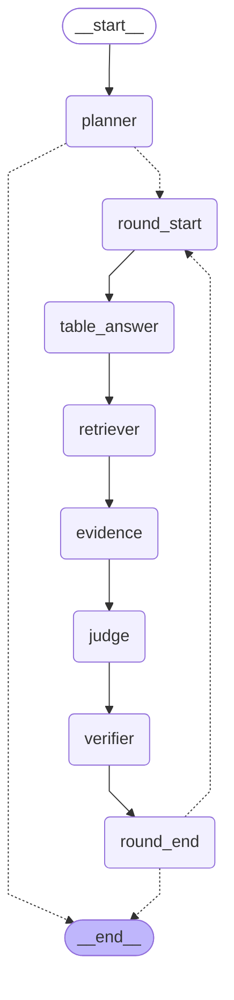

```mermaid
---
config:
  flowchart:
    curve: linear
---
graph TD;
	__start__([<p>__start__</p>]):::first
	planner(planner)
	round_start(round_start)
	table_answer(table_answer)
	retriever(retriever)
	evidence(evidence)
	judge(judge)
	verifier(verifier)
	round_end(round_end)
	__end__([<p>__end__</p>]):::last
	__start__ --> planner;
	evidence --> judge;
	judge --> verifier;
	planner -.-> __end__;
	planner -.-> round_start;
	retriever --> evidence;
	round_end -.-> __end__;
	round_end -.-> round_start;
	round_start --> table_answer;
	table_answer --> retriever;
	verifier --> round_end;
	classDef default fill:#f2f0ff,line-height:1.2
	classDef first fill-opacity:0
	classDef last fill:#bfb6fc

```
